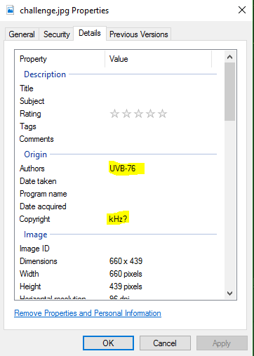
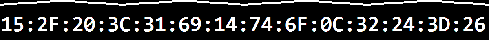
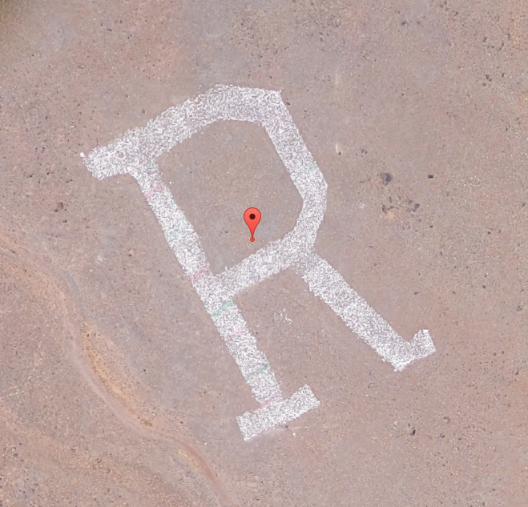
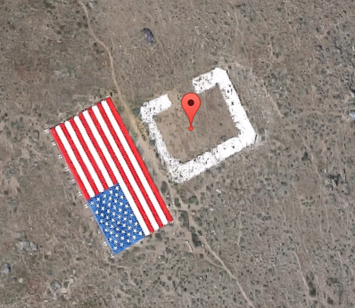

# Agent G - Crypto 500, 0 Solves

> Agent G:  We have a mission for you.  The fate of the nation could very depend on your assistance!  These channels are not secure; if you wish to accept the mission you must first find our more secure transmission.


This is one of my first CTF challenges and certainly one of the most involved.  When I was asked to create a crypto challenge I wasn't sure I knew enough to make a traditional challenge exploiting some odd edge case in a cryptosysystem.  I quickly decided to merge some easier crypto challenges with my favorite thing... Puzzles!  I created a series of phases of challenges with a sort of abstract puzzling twist.

When I make my next challenge I definitely plan on breaking down the phases so that there can be some partial credit if you don't make it all the way to the end of the crazy journey!

## Phase One: Image Stego
Step one of looking at an image challenge is generally to look for any interesting metadata included in the image.  This image contained two very important pieces of metadata:


This is a picture of the UVB-76 number station transmitter.  The copyright metadata was phrased as a question to indicate that the *answer* to the question could be used to help solve the challenge.  This leads to a key of 4625.  The tool `steghide` was used to hide the payload in the image.  Extracting the data results in the following payload:

```
p86?E vi (6VC6 8=25 J@F 92G6 2446AE65 E9:D >:DD:@?]  (6 92G6 @C496DEC2E65 2 D6C:6D @7 5C@AD E@ =625 J@F E@ E96 7:?2= E2C86ED]  %96 56E2:=D 2C6 E@@ D6?D:E:G6 7@C @?6 EC2?D>:DD:@?]  %96 7:CDE A92D6 :D 2E 9EEAi^^4E7]8C6886C?2FE]4@>^2?5\D@\:E\368:?D
```

This is a rot47 encoding of the following message:
> Agent G: We're glad you have accepted this mission.  We have orchestrated a series of drops to lead you to the final targets.  The details are too sensitive for one transmission.  The first phase is at http://ctf.greggernaut.com/and-so-it-begins

## Phase Two: Navajo Code Talker
Going to ctf.greggernaut.com/and-so-it-begins presents the following message:
> Tin Mąʼii Tązhii Dlǫ́ʼii Tłʼízí yázhí tááʼ Tązhii Nóódaʼí Dzeeh Shash Bįįh Tązhii Nóódaʼí Tin Shash Wóláchííʼ Tłʼízí yázhí ashdlaʼ Dibé Dlǫ́ʼii Tsáʼásziʼ tááʼ Shash Wóláchííʼ Naʼastsʼǫǫsí Gah Ałnáʼázdzoh Dlǫ́ʼii dį́į́ʼ Béésh dootłʼizh Téliichoʼí Shash Dzeeh Wóláchííʼ kʼaaʼ yeiłtįįh Mąʼii Néʼéshjaaʼ Béésh dootłʼizh Téliichoʼí Wóláchííʼ Neeshchʼííʼ Neeshchʼííʼ Ałnáʼázdzoh Tłʼízí Tłʼízí yázhí ashdlaʼ Béésh dootłʼizh Wóláchííʼ Bisóodi Mąʼii Ałnáʼázdzoh Ałnáʼázdzoh Tłʼízí yázhí Tin Bįįh Ałnáʼázdzoh Neeshchʼííʼ ashdlaʼ naaki Dlǫ́ʼii Tsáʼásziʼ Béésh dootłʼizh Shash Wóláchííʼ Naʼastsʼǫǫsí Téliichoʼí Dibé Dibé Wóláchííʼ Tsáʼásziʼ Téliichoʼí Wóláchííʼ Néʼéshjaaʼ Shash Dibé Ałnáʼázdzoh Dzeeh Béésh dootłʼizh Tązhii Mąʼii Naʼastsʼǫǫsí Neeshchʼííʼ naaki Mósí Wóláchííʼ Tsáʼásziʼ tááʼ Shash Neeshchʼííʼ Béésh dootłʼizh Dibé Tłʼízí Dibé Béésh dootłʼizh Bįįh Shash Néʼéshjaaʼ Gah Dibé Dibé Wóláchííʼ Béésh dootłʼizh Tązhii Bisóodi Néʼéshjaaʼ Tin kʼaaʼ yeiłtįįh Łį́į́ʼ Tin naaki Bįįh Téliichoʼí Néʼéshjaaʼ Naʼastsʼǫǫsí kʼaaʼ yeiłtįįh Tłʼízí naaki naaki Dibé yázhí Tązhii Néʼéshjaaʼ Neeshchʼííʼ Nóódaʼí Dlǫ́ʼii hastą́ą́ tááʼ Gah Néʼéshjaaʼ Dzeeh Wóláchííʼ kʼaaʼ yeiłtįįh Mąʼii Dibé tááʼ tááʼ Akʼehdidlíní Dzeeh Shash tááʼ Dlǫ́ʼii Dibé tááʼ Bįįh Naʼastsʼǫǫsí Dzeeh Shash Béésh dootłʼizh Dlǫ́ʼii hastą́ą́ tááʼ tááʼ Néʼéshjaaʼ Dzeeh Shash Béésh dootłʼizh Tłʼízí Tłʼízí yázhí Tsáʼásziʼ tááʼ Mąʼii Neeshchʼííʼ Mąʼii tááʼ Tłʼízí Tłʼízí yázhí Tin Bįįh Shash Neeshchʼííʼ Tsáʼásziʼ kʼaaʼ yeiłtįįh Tłʼízí Tłʼízí yázhí tááʼ Tązhii Bįįh Néʼéshjaaʼ Téliichoʼí dį́į́ʼ Ałnáʼázdzoh Wóláchííʼ ashdlaʼ Bįįh Mąʼii Naʼastsʼǫǫsí kʼaaʼ yeiłtįįh kʼaaʼ yeiłtįįh Tłʼízí Dzeeh tááʼ Bįįh Bisóodi Naʼastsʼǫǫsí Tin Ałnáʼázdzoh Mósí Wóláchííʼ Tin Mósí Nóódaʼí Neeshchʼííʼ Shash Dibé Dibé Wóláchííʼ dį́į́ʼ tááʼ kʼaaʼ yeiłtįįh Naʼastsʼǫǫsí Mąʼii Gah Dlǫ́ʼii Tłʼízí yázhí dį́į́ʼ Béésh dootłʼizh Wóláchííʼ Néʼéshjaaʼ ashdlaʼ Nóódaʼí Dlǫ́ʼii Tsáʼásziʼ tááʼ Shash Wóláchííʼ Naʼastsʼǫǫsí Téliichoʼí Dibé Dibé Wóláchííʼ naaki Dibé yázhí Néʼéshjaaʼ Dzeeh Shash Tsáʼásziʼ Tłʼízí hastą́ą́ dį́į́ʼ tááʼ Téliichoʼí Néʼéshjaaʼ Gah Nóódaʼí Dlǫ́ʼii hastą́ą́ tááʼ Tązhii Tązhii Dzeeh Wóláchííʼ Béésh dootłʼizh Dibé Wóláchííʼ Tsáʼásziʼ Dibé yázhí Néʼéshjaaʼ Naʼastsʼǫǫsí kʼaaʼ yeiłtįįh kʼaaʼ yeiłtįįh Bįįh Naʼastsʼǫǫsí Dibé yázhí Gah Wóláchííʼ Dzeeh Shash Bįįh Dlǫ́ʼii hastą́ą́ tááʼ tááʼ Dzeeh Dzeeh Shash Dlǫ́ʼii Łį́į́ʼ Tłʼízí yázhí Tsáʼásziʼ tááʼ Dibé yázhí Mąʼii Tsáʼásziʼ kʼaaʼ yeiłtįįh Mósí Wóláchííʼ naaki Bįįh Nóódaʼí Néʼéshjaaʼ Gah Tsáʼásziʼ Bįįh Nóódaʼí Dibé yázhí Béésh dootłʼizh Bisóodi Naʼastsʼǫǫsí Neeshchʼííʼ naaki Tłʼízí Naʼastsʼǫǫsí Dibé yázhí Tązhii Łį́į́ʼ Néʼéshjaaʼ Téliichoʼí Dibé Dlǫ́ʼii Néʼéshjaaʼ Béésh dootłʼizh tááʼ Mąʼii Néʼéshjaaʼ Téliichoʼí Ałnáʼázdzoh Tłʼízí Mósí ashdlaʼ Dibé yázhí Nóódaʼí Mąʼii Béésh dootłʼizh Gah Dlǫ́ʼii hastą́ą́ tááʼ Téliichoʼí Bisóodi Néʼéshjaaʼ Neeshchʼííʼ kʼaaʼ yeiłtįįh Dlǫ́ʼii naaki Dibé yázhí Dibé yázhí Nóódaʼí Néʼéshjaaʼ Neeshchʼííʼ Ałnáʼázdzoh Dibé naaki dį́į́ʼ tááʼ Mąʼii Neeshchʼííʼ Béésh dootłʼizh Dibé Łį́į́ʼ Tłʼízí Dibé yázhí Dibé yázhí Tin Neeshchʼííʼ Mąʼii Béésh dootłʼizh Dibé naaki dį́į́ʼ Tązhii Mąʼii Naʼastsʼǫǫsí ashdlaʼ kʼaaʼ yeiłtįįh Ałnáʼázdzoh Dzeeh Béésh dootłʼizh Bįįh Tązhii

A quick google of any of those words should reveal that they are navajo words.  In keeping with the theme of spycraft this is based on the use of navajo code talkers during world war 2.  Wikipedia has a [good listing](https://en.wikipedia.org/wiki/Code_talker#Navajo_code_talkers) of the words and their corresponding letter translation.
 
 One drawback to using this sort of letter-based encoding is that it precludes the use of symbols (such as the `/` or `.` in a url)  To get around this, the desired payload was converted to a base32 string.  Base64 was not an option as you cannot guarantee the casing of the letters after decoding.  Fortunately, the charset of base32 is just `A-Z1-7` which can easily be represented using the navajo language
 
 To aid in the decoding I wrote [a python script](phse-2-navajo/navajo.py) to automate the process 

Here is the base32 encoded payload that can be found after properly decoding the Navajo:
```
IFTWK3TUEBDTUIBAK5SWY3BAMRXW4ZJBEAQFOZJANNXGK5ZAPFXXKIDXN52WYZBAMJSSAYJAOBSXEZTFMN2CAY3BNZSGSZDBORSSAZTPOIQHI2DJOMQG22LTONUW63ROEAQFS33VEB3WS3DMEBZW633OEBZGKY3FNF3GKIDBNYQGK3TDOJ4XA5DFMQQGE3DPMIXCAICUNBSSA43QMFRWK4ZAO5UWY3BAMJSSA2LOEBYG643JORUW63TTEAZSAYLOMQQDMLRAEBDW633EEBWHKY3LFYQCA2DUORYDULZPMN2GMLTHOJSWOZ3FOJXGC5LUFZRW63JPONQW2LLUONXS243FNZSHGLLINFZS24TFM5QXEZDT
```

Once decoded, that yields the following message:

> Agent G:  Well done!  We knew you would be a perfect candidate for this mission.  You will soon receive an encrypted blob.  The spaces will be in positions 3 and 6.  Good luck.  http://ctf.greggernaut.com/sam-tso-sends-his-regards


## Phase Three: Morse Code / Spectrogram
The next phase of the challenge includes a morse code broadcast.  The server returns a series of clips of somewhat distorted morse code.  While the names were randomized with each request, there were only 10 tracks.  The content of the morse code brodcast is "a bit" of a troll:
`thereisnomeaninginthismessagedonotseekforoneyouwillfailwhyareyouevendecodingthiswowwhatawasteoftimeyouregoingtorunoutoftimeatthisratetrololo`

This is only half the story, however; there is also meaning hidden in the noise of the tracks.  If you look at the spectrogram of the tracks using audacity you see there is also a string of hex bytes.  In order to get to the next phase of the message the hex bytes need to be xor'd against the morse code.  Each track contains 14 characters in morse code, and 14 hex bytes

These bytes were added using a tool called coagula.  The input images looked like this:

```
Agent G: Aweso
--------------
1
nginthismessag
03:02:49:39:1B:1A:02:52:67:20:1D:10:0E:03
me Work!
Encod
--------------
2
edonotseekforo
00:00:4F:1E:0E:0D:1F:0A:04:0F:46:1A:01:0A
ed payload use
--------------
3
neyouwillfailw
1D:45:0D:07:1C:04:49:0D:00:16:09:08:0E:12
s this alphabe
--------------
4
hyareyouevende
1C:43:41:5E:48:57:5F:44:57:45:51:5B:52:52
t: ,-.01234567
--------------
5
codingthiswoww
5B:56:05:0B:0D:02:12:00:00:18:1B:02:18:07
89abcefhiklmop
--------------
6
hatawasteoftim
1A:12:00:6B:1F:15:07:04:5F:40:49:17:1D:0B
rst
http://ctf
--------------
7
eyouregoingtor
4B:1E:1D:10:15:02:02:1D:07:0F:12:00:41:11
.greggernaut.c
--------------
8
unoutoftimeatt
1A:03:40:1C:00:1C:4B:1E:1C:1E:11:4C:15:59
om/its-just-a-
--------------
9
hisratetrololo
07:07:16:5F:15:1D:08:11:5F:1B:04:06:02:08
one-time-thing
--------------
```

The final message is as follows:
> Agent G: Awesome Work!
> Encoded payload uses this alphabet: ,-.0123456789abcefhiklmoprst
> http://ctf.greggernaut.com/its-just-a-one-time-thing


## Phase Four:  Playlist / Book cipher (Loosely)

The next phase starts out with a link to a google music playlist.  The hint suggests that Maybe you should give them a listen.

The first song, "Half Built House" is the most important.  It's lyrics are that of a number station: 0096 2251 2110 8105 (Repeats 5x).  Those lyrics are then used as indices into the names of the songs in the rest of the playlist.  (Given more time I would have loved a truly diabolical variant where the indexing was into the lyrics of the songs themselves >:) )

The full playlist and decoding is [here](phase-4-playlist/Playlist.txt)

Following this pattern the plaintext message:
> Secret Key Num Nickel year front side greggernaut com one cipher plox

## Phase Five: VIC Cipher

The preceding answers have been giving parameters to the crypto-system used in this phase.  Here they finally get to be used.  the VIC cipher is relatively unknown, but a google of "nickel cipher" does bring up the [excellent wikipedia article](https://en.wikipedia.org/wiki/VIC_cipher) detailing the operation of this cipher

```
78737 17632 11651 19103 48640 54425 20750 57474 72767 36031
21517 84927 40721 09343 61425 79261 19215 19112 72417 91093
43613 27138 11193 63871 49724 93882 40419 12878 89273 67952
82895 14270 41794 07149 79179 09385 02786 79052 61477 18931
31704 11702 68249 12171 82865 64761 91528 12262 10715 13142
53525 80665 08798 25822 63338 66418 06638 32116 49417 93282
53115 93232 63422 12449 41204 32122 75404 78135 02726 95148
61167 04995 10153 25112 81377 81430 49794 91742 41176 14433
53499 18112 42499 84990 92468 28513 61132 24328 03611 63158
28249 53631 44811
```

The relevant information for this cipher is:
- Spaces in the grid at positions 3 and 6
- The alphabet of the grid is `,-.0123456789abcefhiklmoprst`
- The key used to further distort the ciphering is the year on the front side of [the nickel where this cipher was first seen](https://en.wikipedia.org/wiki/Hollow_Nickel_Case#Background), 1948

Finally decoding this results in the plaintext:

> take.care.of.this.problem....39.553469,-119.864375,39.158076,-119.787425,43.485954,25.716452,34.260902,-88.766856,31.300248,131.078382,47.772447,-116.829302,41.199670,-80.486106,42.244626,-71.003112,42.120352,-76.900029,40.718361,-73.936826,42.424801,-84.527512,-22.659735,14.565248,53.814100,-3.055051,51.353292,0.503093,40.524943,-112.248105


## Phase Six: Dead Drop

There are 30 numbers in the previously decoded text.  These are coordinates, that, when looks at using Google Maps, reveal the flag using giant letters in the satellite view:



etc... 

Finally, the flag is **RC3-2016-J.BOZART**  Jimmy Bozart was the newspaperboy who discovered the [hollow nickel](https://en.wikipedia.org/wiki/Hollow_Nickel_Case) and exposed Reino Häyhänen, the soviet spy.

```
R		39.553469, 	-119.864375
C		39.158076, 	-119.787425
3		43.485954, 	25.716452

2		34.260902, 	-88.766856
0		31.300248, 	131.078382
1		47.772447, 	-116.829302
6		41.199670, 	-80.486106

J		42.244626, 	-71.003112
.		42.120352, 	-76.900029
B		40.718361, 	-73.936826
O		42.424801, 	-84.527512
Z		-22.659735,	14.565248
A		53.814100, 	-3.055051
R		51.353292, 	0.503093
T		40.524943, 	-112.248105
```