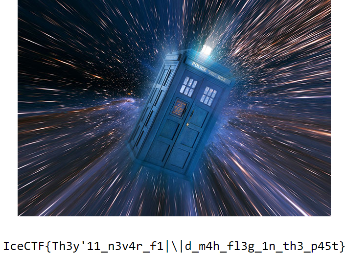

# Time Traveler (Forensics - 45 Points,  1013 solves)

> I can assure you that the flag was on [this website](http://time-traveler.icec.tf/) at some point in time. 

Solution
--------

For this challenge we are going to use [Wayback Machine](https://archive.org/web/) to find the flag.

When we query for the website we can see there was one snapshot saved on June 1st.

If we click on the snapshot we get the flag!

Flag: 'icectf{Th3y'11_n3v4r_f1|\|d_m4h_f13g_1n_th3_p45t}'

