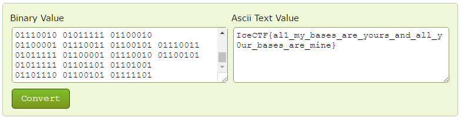

# All your Base are belong to us (Misc - 15 Points, 1523 solves)

> What a mess... we got a raw flag but now what do we do...[flag.txt](https://play.icec.tf/problem-static/flag_63c24d48595eae318c9a174f37ffb0f128758e5c16fea0ffebf12b0ba5f5b26a.txt)

Solution
--------

You are given a website with some binary...

You then want to copy the binary and want to convert it to ASCII, either write a tool yourself or simply find one of many online (here's one)

Flag: 'IceCTF{al1_my_bases_are_yours_and_all_y0ur_bases_are_mine}'

