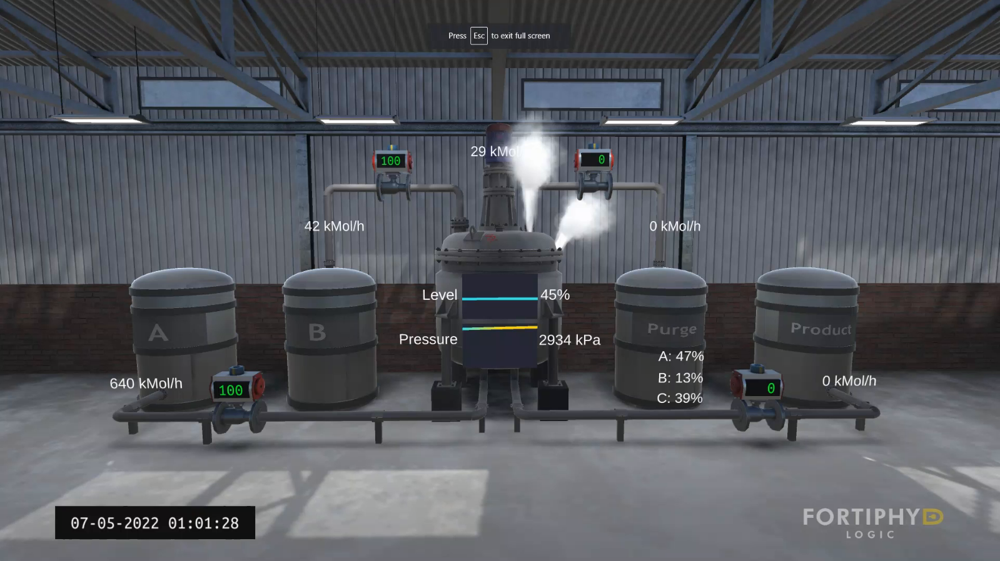
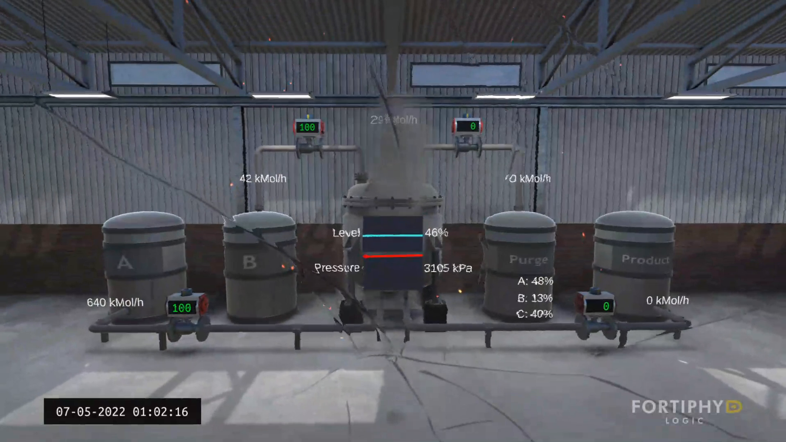
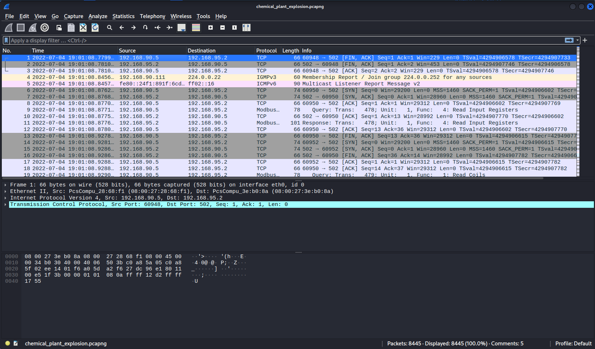
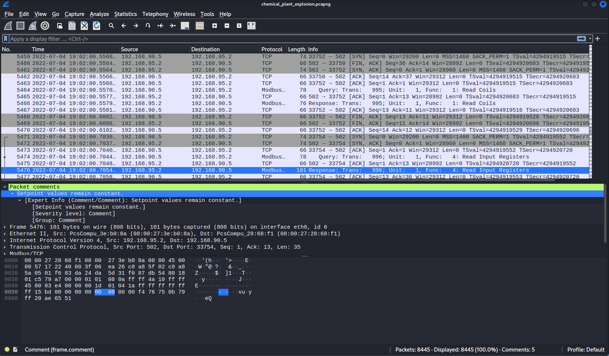
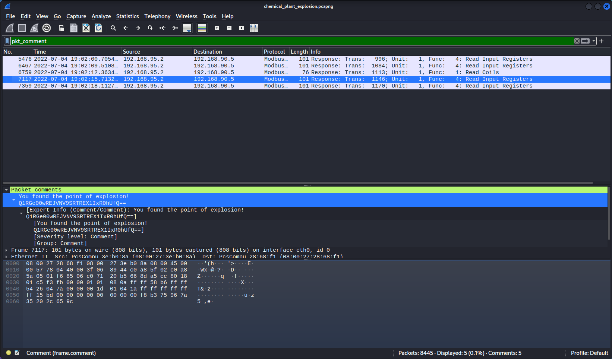
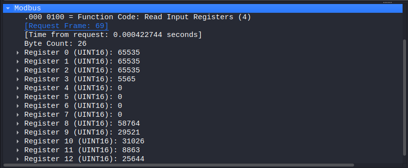

# Chemical Plant

**Category:** Network, ICS

**Points:** 100, 4 flags

**Solved By:** Chandi95

## Challenge

> A chemical plant has exploded, can you help us investigate why this happened?
>  
> *Author information: This challenge is developed by CRaghuraman@deloitteNL.*

Files: `chemical_plant_explosion.pcapng`, `chemical_plant_explosion.mp4`

## Solution

### Flag 1: Find the Attack Point [10 points]

> Which component was altered in the plant? (Flag format: CTF{component})

Since we are given two files, let's check out the video first. Opening it up, this is the first frame:


While this may look intimidating to anyone not from a chemistry background, we can still try and break down what's going on in the image.

On the left, we see containers labeled "A" and "B" with pipes going from each of them to the container in the center. At a certain point in the pipes, there appear to be gauges of some sort with displays showing "100". On the right side of the middle container, we see containers labeled "Purge" and "Product". The setup is similar to the left side, except the gauges' displays have a value of 0.

From this frame alone, we can conclude that something is flowing from containers A and B to the container in the middle (given by the value 100 on the left side gauges), but is unable to exit the container and flow to the right side (given by the value 0 on the right side gauges). The steam escaping from the right side of the container only adds to this line of thought. Let's watch the video and see what happens.

At around 47 seconds into the video, something happens:


Oh no! An explosion has occurred! While things may be a bit difficult to see due to the cracked glass, let's try and analyze the differences between this frame and the beginning frame.

Aside from the smoke rising from the central container, we can see another difference between the two images: the "Pressure" value is now 3105 kPa, and the bar next to it is red. In my experience, red usually means "bad" or "critical", and something like "critical pressure" seems likely to cause an explosion.

Now, the challenge question asks us to find which *component* was altered in the plant. I thought that maybe the pressure gauges had been altered to not allow flow to the right side containers, but that was not the answer. I tried other names, like "valve", but those weren't correct either. I guessed "pressure" since that was the thing that changed throughout the video, and it ended up being the correct answer.

**Flag:**

```lintingerrorsbad
CTF{pressure}
```

### Flag 2: Record Everything [40 points]

> We have files showing what happened during the attack. Can we pinpoint the exact moment of the attack in the network?

The challenge question asks us to pinpoint the exact moment of the attack in the network, so a good starting point would be to look at the capture file. Opening up the file in Wireshark, this is what we see:


One of the first things we see are a couple of packets (9, 11, 19) with the "Protocol" field being labeled as "Modbus". Doing a quick Google search on what Modbus is, we learn that it's a serial communications protocol for use with Programmable Logic Controllers (PLCs). PLCs are a key component of an ICS (Industrial Control System), which can be defined an electrical system used for controlling "industrial" processes...such as those in a chemical plant.  

I went down a rabbit hole of trying to understand what exact values were being sent through the Modbus protocol, thinking that the flag was somehow encoded in the values that were being sent over the connection. Not being able to find anything and having too much time on my hands, I resorted to scrolling through each packet and seeing if anything stood out.

Eventually, I spotted something:


Packet comments? I had no idea those were a thing. This one revealed a hint to the third part of this challenge, so I noted the packet number down and did some research on packet comments. It turns out you can see what packets contain comments by applying a display filter of `pkt_comment` or by going to `Analyze > Expert Information`.

After applying the filter, I saw 5 packets that had comments attached to them. While some contained information relevant to other parts of this challenge, the comment on the fourth packet in this list (packet 7117) tells us that the point of explosion has been found:


The second line of the comment contains a base64 encoded string (noted by the use of two '=' characters at the end of string). For some reason Wireshark wasn't letting me copy the string out, so I just typed it out manually. We can use something like [CyberChef](https://gchq.github.io/CyberChef/) or the `echo` and `base64` commands to decode the string and get the flag:

```bash
echo 'Q1RGe00wREJVNV9SRTREX1IxR0hUfQ==' | base64 --decode
```

**Flag:**

```lintingerrorsbad
CTF{M0DBU5_RE4D_R1GHT}
```

## Flag 3: Know The Limit [30 points]

> Can you find the setpoint value of the attacked component? HINT: A setpoint value does not change under any circumstance. (Flag format: CTF{(value)})

I actually solved this one before finding the second flag due to my scrutinizing of every Modbus-related packet in the packet capture file. Let's start by trying to define what a setpoint value even is. A setpoint value can be defined as a target value that's set for a system/process. It is a value that the control system aims to achieve through the adjusting of another process value.

Next, let's look at the data stored within a Modbus packet, using Wireshark:


The important thing to pay attention to are the different registers. These hold different numbers that are related to the operation of the system/process using Modbus to communicate. But which one is a setpoint value?

Take note of the hint, that a setpoint value doesn't change under any circumstance. Using all the information we've learned thus far, we can guess that we're looking for a value within the Modbus registers that doesn't change. After looking through multiple packets, I concluded that the value that doesn't change is `65535`. I wrapped that value in the flag format, submitted it, and it was correct!

**Flag:**

```lintingerrorsbad
CTF{65535}
```

## Flag 4: True or False [20 points]

> What type of data is stored in register coils? (Flag format: CTF{datatype})

This question doesn't really focus on the packet capture file at all, but rather requires a basic understanding of how Modbus works. We already know a little bit about registers, so let's expand on that.

Doing some research on Modbus registers, I found that there are different types: Input Register, Holding Register, Discrete Input, and Coil. Coil? That sounds exactly like what we're looking for. I found that register coils hold single bit output values, either a 0 or a 1. True or False. I tried "bits" as the answer but that didn't work.

Well, another term for "bit" is "binary value", so what if we try "binary"? Wrapping it in the flag format, the answer is correct, and the challenge is complete!

```lintingerrorsbad
CTF{binary}
```
