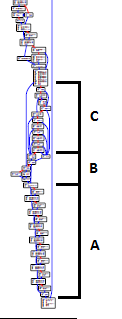
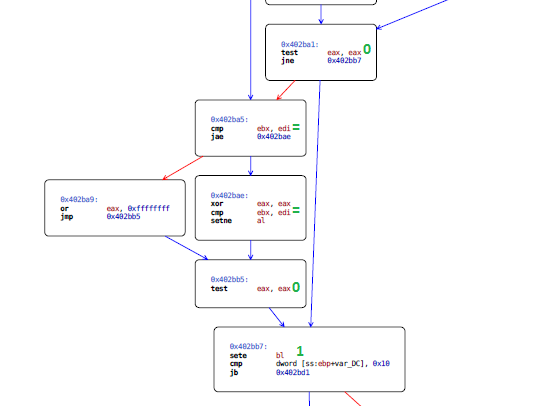
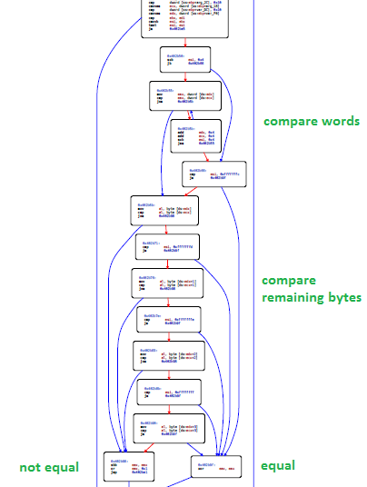

# Licensable - Reverse, Warm-up - 121 points

## Problem
> Generate a [license](licensable.exe) for `admin@asis-ctf.ir`. Flag format is
> `ASIS{md5(license)}`.

This binary takes in two arguments, an email address and a "license". Don't
know what a license looks like, but let's try running it:
```
> licensable.exe admin@asis-ctf.ir 1234
calculating : 99.916817 %
res = 0
```
Ok, so I'm assuming that we want it to output `res = 1`.

## How I should have solved it
Looking at the strings of the binary and stepping through it in a debugger
reveals that "\rcalculating : %f %%" is printed out at address 0x402940. This
function (the one starting at 0x4025b0) seems to do a lot of computation, so
let's assume that it's what computes and checks the license. In fact, we can
test this by setting a breakpoint at 0x402d7e, the end of the function, and
then changing EAX to 1:


```
calculating : 99.916817 %
res = 1
```
Sure enough, if the return value of this function is 1, the program outputs 1!

So, what can we do to make the function return 1?

We consider the function from bottom to top, in sections (note, the full graph
is [here](licensable.pdf) if the screenshots are too small to read):



There are two ways to get to the last basic block of this function. One,
0x402d61, sets al to zero, so that can't be what we want. The other,
0x402d11, has a `mov al, bl`. Now we're looking for how to set bl to 1 and
keep it that way. Section A of the function (0x402bc3 to 0x402d0e) consists of
repeated calls to the function at 0x4081de. I can't see any modifications of
ebx in that function, or in the first few of its called functions that I looked
at, so I take a wild guess that it leaves ebx alone completely. To check this I
try modifying ebx before that section in a debugger and see that it's
propagated to eax at the end. Great, we can ignore section A.



Section B (0x402ba1 to 0x402bb7, roughly) is what's responsible for setting bl.
The only way it will be set to 1 is if the Z flag is set at 0x402bb7, meaning
eax is 0 at 0x402bb5, which happens if ebx and edi are equal at 0x402ba5 and
eax is 0 at 0x402ba1. That brings us to section C.



Section C (0x402b4c to 0x402b9f) is what sets the value of eax at 0x402ba1.
This section implements something similar to memcmp(edx, ecx, esi); it outputs
zero if the two strings are equal, and 1 otherwise.

At this point I set a breakpoint at 0x402b4c to see what the strings in edx and
ecx are, expecting to see two things I don't recognize. Instead, I see one long
base64 value and my input license, "1234".


So it's just comparing the input
with this value? It seems like it's deriving it from the email address, so it
should be the same every time. What happens if we use that string as the
license?
```
>licensable.exe admin@asis-ctf.ir OTA0ZDQyZWIxN2YzMjQxNDc2NzVkYjg3YWYzOWU0ZmU5MTlhNTQxN2I5NGExNzhhNzFlODU1ZjViMzhhZjA5ZA==
calculating : 99.916817 %
res = 1
```
Awesome! Now we just have to hash that for the flag:
```
ASIS{md5(license)} = ASIS{3e5206e41a327a158426599de8494bfc}
```

## What I actually did
Before doing any of the stuff in the previous section, I decided to hunt down
what was actually printing the output "res = 0" to the console. I found that
the call at 0x402e5c printed out "res =" and using a debugger confirmed that
the call at 0x402e66 printed out the "0". Then I spent a couple of hours
stepping through the called function to see which instruction printed it out,
then stepping through the function that called, and so on, to trace back to
where the printed value actually comes from. In the end I found that the call
at 0x402e66 prints out the value that's in bl, and where does that value come
from? It's the return value of the function discussed in the last section. The
code is written to be weird looking - for example, lots of calls to offsets of
function pointers passed as arguments, and lots of unnecessary stack
manipulations - so I didn't feel comfortable assuming that the function that
printed "calculating" was actually the important one, but I probably should
have looked at it first anyway.
