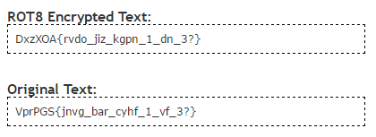
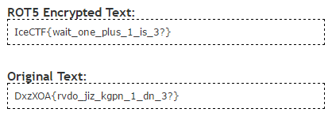

# Rotated! (Crypto - 20 Points, 1451 solves)

> They went and ROTated the flag by 5 and then ROTated it by 8! The scoundrels! Anyway once they were done this was all that was left VprPGS{jnvg_bar_cyhf_1_vf_3?}

Solution
--------

It's fairly easy to see the hint within "ROTated," that being said lets go right to looking at ROT 5 and ROT 8. One thing to remember in ciphertext like this you need to undo the encoding by doing the <b>reverse</b>.

> Encode: Plaintext -> ROT 5 -> ROT 8

> Decode: Ciphertext -> ROT 8 -> ROT 5

You can either write a tool yourself or simply find one of many online (here's one)

So what we did was pipe the ciphertext into the ROT 8 decoder and got a new string:

> DxzXOA{rvdo_jiz_kgpn_1_dn_3?}

Now we take the new string and pipe it back into the program to get the flag.

Flag: 'IceCTF{wait_one_plus_1_is_3?}'

