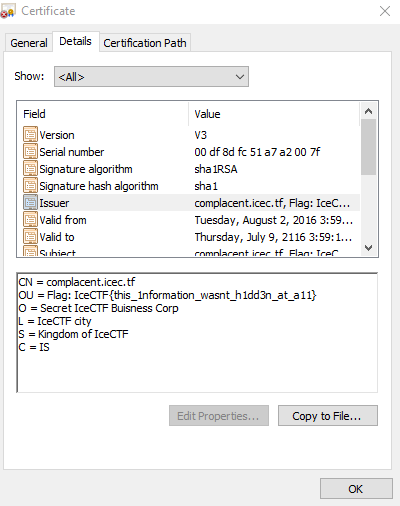

# Complacent (Reconnaissance - 40 Points,  1009 solves)

> These silly bankers have gotten pretty complacent with their self signed SSL certificate. I wonder if there's anything in there. [complacent.vuln.icec.tf](https://complacent.vuln.icec.tf/)

Solution
--------

For this challenge we are going to use the inspect element in Chrome and go to the "Security" tab.

Since the hint for this challenge mentions a SSL certificate we want to look at the certificate.

Once we are in the "Security" tab, we click "View Certificate.""

Here we find the flag under "Issuer"

Flag: 'IceCTF{this_1nformation_wasnt_h1dd3n_at_a11}'

