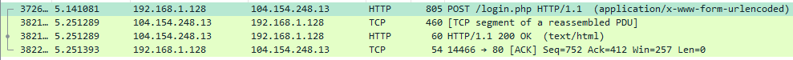
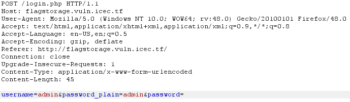
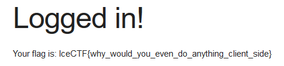

# Flag Storage (Web - 50 Points, 748 solves)

> What a cheat, I was promised a flag and I can't even log in. Can you get in for me? [flagstorage.vuln.icec.tf](http://flagstorage.vuln.icec.tf/). They seem to hash thier passwords, but I think the problem is somehow related to [this](https://en.wikipedia.org/wiki/SQL_injection).

Solution
--------

For this challenge you will need to do SQL Inject (see hint above). Despite being SQLi this is a little more complex than injecting into fields on the webpage.

If you capture the traffic between you and the server you will see why...

First you want to find the POST you sent to the server

Once you find the session, analyze the TCP Stream.

As you can see in the red font (what I am sending to the server) the very last line contains the following:

  username=admin&password_plain=admin&password=e3b0c44298fc1c149afbf4c8996fb92427ae41e4649b934ca495991b7852b855

You can see that I tried admin as the username and admin as the password. Then here is the interesting part, there is a password hash.
The reason SQL injection of the password field will <b>NOT</b> work is because a hash is submitted and thus your attempt at '' or 1=1;#'' will just be hashed and not work.

However, this means we need to "escape" the hashing [so to speak] by injecting into the hash field.

It is at this point we will want to use a proxy like [Burp Suite](https://portswigger.net/burp/) to intercept our traffic between the web browser and the server.

Once intercepted it should look like this:

THe next step is the injection, we cannot just enter <b>' or 1=1;#</b>, we must first URL encode it.

URL Character Encoding

  <space> == %20
  
  ' == %27
  
  = == %3D
  
  ; == %3B
  
  # == %23

Putting it all together:

Send POST and Profit!

Flag: 'IceCTF{why_would_you_even_do_anything_client_side}'

