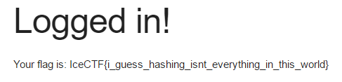

# Kitty (Web - 70 Points, 568 solves)

> They managed to secure their website this time and moved the hashing to the server :(. We managed to leak this hash of the admin's password though! c7e83c01ed3ef54812673569b2d79c4e1f6554ffeb27706e98c067de9ab12d1a. Can you get the flag? [kitty.vuln.icec.tf](http://kitty.vuln.icec.tf/)

Solution
--------

The first thing you want to do is look at the page source, you will notice specific password requirements to even send a POST to the server.

'''
<form method="post" action="login.php">
    <label for="username">Username: </label>
    <input class="u-full-width" type="text" name="username" placeholder="Username" required <b>minlength="5"</b> />  
    <label for="password">Password: </label>
    <input id="password" class="u-full-width" type="password" name="password" placeholder="Password" required pattern="[A-Z][a-z][0-9][0-9][\?%$@#\^\*\(\)\[\];:]" />
	<input type="submit" value="Log In" />
'''

Using this information we can either bruteforce the password since it is a small enough keyspace or use an online tool to crack it.

In this case, I'm going to brute force it with [Hashcat](https://hashcat.net/hashcat/)

You will find that the password is 'Vo83*' which matches our password requirements as described above.

Flag: 'IceCTF{i_guess_hashing_isnt_everything_in_this_world}''
