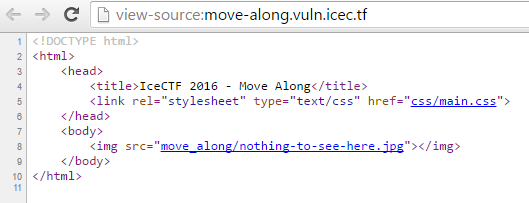
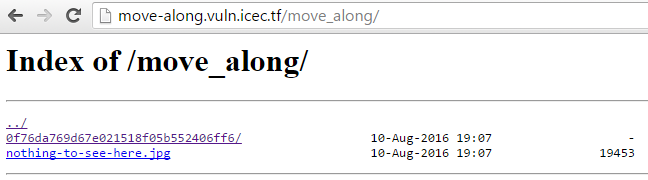
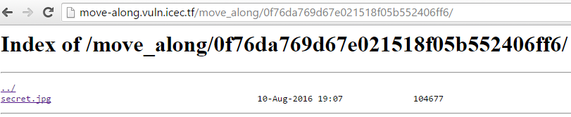

# Move Along (Web - 30 Points, 1181 solves)

> [This site](http://move-along.vuln.icec.tf/) seems awfully suspicious, do you think you can figure out what they're hiding?

Solution
--------

The first step is to look at the source of the page we are given.

We then notice the picture that is on the homepage is being pulled from a directory called "move_along" this seems interesting...

When navigating to this directory we notice another directory called "0f76da769d67e021518f05b552406ff6"

There is file in the directory called "secret.jpg" once we open it up... BOOM, theres the flag!

Flag: 'IceCTF{tH3_c4t_15_Ou7_oF_THe_b49}'

