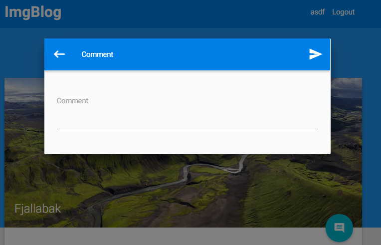
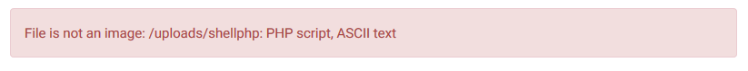
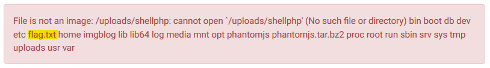

ImgBlog (Web - 130 points, 79 solves)
===============================
> I found this amazing [blog about Iceland](http://imgblog.vuln.icec.tf/) Did I ever tell you that I love Iceland? It seems to be made from scratch by a single guy although being impressive, he doesn't seem too have much experience with web programming. Can you see if you can find any vulnerabilites to pwn his machine?

Solution
--------

The website for this challenge looks like a simple blog.  This is the homepage:

There are login and register buttons.  I started off with some standard `admin' or 1=1; -- ` injections for the username and password but with no success.  Oh well, this is one of the higer pointed web challenges so it's probably something more involved than that.  The description text suggests to me that there might be some XSS vulnerabilities - how else would we "pwn his machine".

I tried logging with my favorite credentials, `asdf:asdf`.  Lo and behold, some other hacker has gone through the trouble of registering for me!

Once logged in, we have the ability to comment on the posts.  A ha!  A potential XSS vector!

Let's try some simple XSS and see if the page is vulnerable:

    One security please! 

Darn, looks like they're properly escaping the input.  There are two links associated with each comment:
* A report button
* A comment permalink

The report button did not appear to do much at first glance.  The comment permalink proved to be quite interesting however...

This has to be an intentional bug, so lets see if we can exploit it.  I have a hunch that there's an authenticated account that will visit any comment that has been reported, so lets try to dump the cookies and see what we can get.  To do this I just used a simple document.write to trigger a get request containing the script-accessible cookies.

    

On the other end of that snippet is a simple netcat listener waiting for the get request.

    ~ » nc -l 8989
    GET /session=eyJ1c2VyIjoxfQ.CqE6uA.El7XiKvPy9p1BrAuEYE5YGjy0t8 HTTP/1.1
    Referer: http://127.0.0.1:5300/comment/086c1db74162aff4ef376dcf493f8b
    User-Agent: Mozilla/5.0 (Unknown; Linux x86_64) AppleWebKit/538.1 (KHTML, like Gecko) PhantomJS/2.1.1 Safari/538.1
    Accept: */*
    Connection: Keep-Alive
    Accept-Encoding: gzip, deflate
    Accept-Language: en,*

Wahoo!!  We got a session token!  Lets pop that into our cookies and see what we get!

Well, we didn't get a flag, but we do have an upload page that looks like it could be pretty interesting.

I tried running basic sql injections on the forms with no success.  The interesting thing appeared to be the image upload tool.  At first glance the verification seems reasonable, if a non-image is supplied it reports an error like this.

That output format looked vaguely familiar though, so I gave it a quick Google.  Turns out that's the output from the unix `file` utility!  They couldn't be using `file` to determine the type of the upload, could they?!  I loaded up my trusty tamperdata plugin and tried changing the filename to include a command and... success!

Through some trial and error I determined that the form stripped the period so I ran `cat flag*` and got the flag.

### Flag:
`IceCTF{why_would_you_use_shell_commands_in_your_web_app_plz_stop}`

